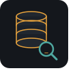

<div align="center">
  

  <h1>YEAGER<span style="color:#e8a33d">.</span></h1>

  <p><strong>Aprenda SQL resolvendo casos reais de banco de dados — direto no navegador.</strong></p>
  <p>
    Yeager é o laboratório de treinamento interno da <strong>VR Tech</strong>: cada tabela do
    sistema de gestão vira um chamado de suporte técnico, e cada chamado vira uma consulta SQL
    que você precisa acertar. SQLite compilado para WebAssembly, zero servidor, zero upload.
  </p>

  <p>
    <a href="https://project-yeager.vercel.app">
      
    </a>
    <a href="https://github.com/jonasPereira533/project-yeager">
      
    </a>
  </p>

  <p>
    <a href="./.github/workflows/ci.yml">
      
    </a>
    
    
    
    
    
    
    
    <a href="./LICENSE">
      
    </a>
  </p>

  <p><em>Treinamento interno · JJ Informática · dados dos casos 100% fictícios</em></p>
</div>

---

## Índice

- [Sobre](#sobre)
- [O problema](#o-problema)
- [Como funciona](#como-funciona)
- [Casos disponíveis](#casos-disponíveis)
- [Níveis, XP e dicas](#níveis-xp-e-dicas)
- [Recursos](#recursos)
- [Banco de dados dos casos](#banco-de-dados-dos-casos)
- [Stack](#stack)
- [Testes](#testes)
- [Rodando localmente](#rodando-localmente)
- [Variáveis de ambiente](#variáveis-de-ambiente)
- [Firebase e progresso](#firebase-e-progresso)
- [Estrutura do projeto](#estrutura-do-projeto)
- [Scripts](#scripts)
- [Integração contínua](#integração-contínua)
- [FAQ](#faq)
- [Contribuindo](#contribuindo)
- [Créditos](#créditos)
- [Licença](#licença)

---

## Sobre

Yeager nasceu para resolver um problema comum em equipes de suporte: o técnico aprende SQL na
teoria e trava na prática. Aqui a prática é a primeira coisa — o banco já está montado, o
chamado já está aberto e a única saída é a consulta certa.

Cada caso carrega um contexto real de atendimento (um cliente que não fecha venda, um caixa que
nunca fechou, itens vendidos fora do preço de tabela), um banco SQLite em memória com dados
fictícios, e três objetivos que precisam ser respondidos. A validação compara o **conjunto de
linhas** devolvido pela sua consulta com o gabarito — a ordem das linhas e das colunas não importa,
então você pensa em _o que o caso pede_, e não em como o avaliador vai comparar.

Tudo acontece dentro do navegador: o SQLite vem do `sql.js` (WASM) e nenhum dado sai da máquina.

## O problema

| O que trava o técnico hoje              | O que o Yeager faz                                                |
| --------------------------------------- | ----------------------------------------------------------------- |
| `SELECT * FROM ...` e torcer            | Casos com pergunta objetiva e resposta verificável                |
| Copiar consulta de fórum e não entender | Vocabulário real: `Cli_For`, `Movimento_Produto`, chaves com `__` |
| Banco de produção intocável             | Banco fictício, recriado a cada caso, sem risco                   |
| Praticar sem perder nada                | Consultas ilimitadas — errar não custa nada                       |
| SQL é matéria de faculdade              | SQL é ferramenta de quem resolve chamado às 9h da manhã           |

## Como funciona

1. **Receba o caso** — leia o dossiê (contexto, categoria, tabelas envolvidas) e as regras da
   investigação.
2. **Explore o esquema** — o painel ao lado do editor lista as tabelas do caso e todas as colunas
   disponíveis, lidas direto do banco via `PRAGMA table_info`.
3. **Escreva a consulta** — editor CodeMirror com dialeto SQLite, highlight, autocomplete de
   tabelas/colunas em dois níveis (`Tabela.` abre as colunas) e atalho `Ctrl/Cmd + Enter` para rodar.
   Colunas `BOOLEAN` do esquema aceitam `true`/`false` tanto quanto `1`/`0`.
4. **Confirme o resultado** — o carimbo mostra `CHAMADO ENCERRADO` quando a resposta bate com o
   gabarito e `AINDA EM ABERTO` quando ainda não bate, com uma linha explicando o que não conferiu
   (quantidade de linhas, de colunas ou valores). Errar de sintaxe só devolve o erro técnico do
   SQLite, sem penalidade.
5. **Feche o caso** — zerados os três objetivos, o caso entra no modo "concluído" com o resumo de
   XP e um atalho para o próximo caso.

Cada objetivo guarda seu próprio rascunho, por caso: saia do caso, volte depois e o editor retoma
onde você parou, inclusive o objetivo selecionado.

## Casos disponíveis

14 casos, 42 objetivos, 1285 XP no total. Todos vieram do `etrade2.sql`, o banco do sistema de gestão
usado pela VR Tech (módulos de vendas, estoque, financeiro, fiscal e permissões).

| Nº  | Caso                                                  | Nível         | Categoria                           | Tabelas                                               | XP  |
| --- | ----------------------------------------------------- | ------------- | ----------------------------------- | ----------------------------------------------------- | --- |
| 001 | Clientes Bloqueados no Cadastro                       | Iniciante     | Suporte Técnico — Cadastro          | `Cli_For`                                             | 45  |
| 002 | Produtos Abaixo do Estoque Mínimo                     | Iniciante     | Suporte Técnico — Estoque           | `Estoque_Atual`                                       | 45  |
| 003 | Motivos de Cancelamento Bagunçados                    | Iniciante     | Suporte Técnico — Configuração      | `MotivoCancelamento`                                  | 45  |
| 004 | Vendas que Sumiram do Fechamento                      | Intermediário | Suporte Técnico — Caixa             | `Movimento`, `Cli_For`                                | 65  |
| 005 | Itens Vendidos Fora do Preço de Tabela                | Intermediário | Suporte Técnico — Vendas            | `Movimento_Produto`, `Produto`                        | 65  |
| 006 | Caixas que Nunca Fecharam                             | Intermediário | Suporte Técnico — Financeiro        | `Financeiro_Caixa_Mov`, `Caixas`                      | 65  |
| 007 | Clientes de Compra Única Acima da Média               | Avançado      | Suporte Técnico — Marketing/Vendas  | `Movimento`, `Cli_For`                                | 90  |
| 008 | Produtos Vendidos com Prejuízo                        | Avançado      | Suporte Técnico — Financeiro/Fiscal | `Movimento_Produto`, `Produto`                        | 90  |
| 009 | Ranking de Vendedores por Filial                      | Avançado      | Suporte Técnico — Comercial         | `Movimento`, `Funcionario`                            | 100 |
| 010 | ICMS Desonerado Preso em Nota de Devolução            | Avançado      | Suporte Técnico — Fiscal            | `Movimento`, `Movimento_Produto`, `Filial`, `Cli_For` | 135 |
| 011 | Valor Final Divergente após Zerar o IPI               | Avançado      | Suporte Técnico — Financeiro/Fiscal | `Movimento`, `Movimento_Produto`                      | 135 |
| 012 | Vencimento de Parcela Fora do Padrão                  | Avançado      | Suporte Técnico — Financeiro        | `Movimento`, `Movimento_NFe`, `Movimento_Financeiro`  | 135 |
| 013 | Caixa que Não Fecha por Funcionário Inativo           | Avançado      | Suporte Técnico — Caixa/RH          | `Financeiro_Caixa_Mov`, `Funcionario`                 | 135 |
| 014 | Bug do Troco Subtraindo o Total da Forma de Pagamento | Avançado      | Suporte Técnico — Financeiro        | `Movimento_Financeiro_Diario`                         | 135 |

## Níveis, XP e dicas

| Nível         | O que é exercitado                                                                   | Casos | XP do nível |
| ------------- | ------------------------------------------------------------------------------------ | ----- | ----------- |
| Iniciante     | Uma tabela por vez, `WHERE`, `ORDER BY`, `GROUP BY`                                  | 3     | 135         |
| Intermediário | Junções entre tabelas e filtros combinados                                           | 3     | 195         |
| Avançado      | Múltiplas junções, subconsultas, CTE, window function, agregação e pistas escondidas | 8     | 955         |

- Cada objetivo tem XP próprio (de 10 a 60), exibido na lista de objetivos.
- Pedir a **dica** de um objetivo custa **-5 XP** naquele objetivo. Dica é recurso limitado, não
  passo obrigatório.
- Sem login, o progresso fica só na memória da aba. Fazendo login com Google, ele vai para o
  Firestore e volta em qualquer máquina — inclusive migrando o progresso que já era seu como
  visitante.

## Recursos

**Investigação**

- Casos com dossiê (briefing), regras e objetivos independentes, navegáveis por abas.
- Esquema do banco lido em tempo de execução (`sqlite_master` + `PRAGMA table_info`) e mostrado
  ao lado do editor — nunca um schema hardcoded.
- Editor CodeMirror 6 com dialeto SQLite case-insensitive, autocomplete de tabelas e colunas em dois
  níveis conforme o caso muda, `Tab` para indentar, quebra de linha automática e tema próprio (âmbar
  sobre fundo escuro).

**Validação**

- Comparação por conjunto de linhas, sem o resultado precisar ser idêntico ao gabarito:
  - ordem das linhas **e** das colunas dentro da linha não importam;
  - a quantidade de linhas e de colunas precisa bater exatamente, e duplicatas contam;
  - valores são tolerantes: `10` casa com `'10'`, `São Paulo` com `sao paulo`, `''` com `NULL`, e
    números comparam com tolerância de ponto flutuante em vez de arredondamento fixo — assim
    `AVG()` sem `ROUND()` bate com o gabarito, mas uma diferença real de centavo reprova;
  - qualquer instrução da sua consulta pode conter o resultado, então um `SELECT` de debug no fim
    não afunda uma resposta certa.
- Quando não bate, o carimbo diz o quê: linhas a mais ou a menos, número de colunas diferente, ou
  valores que divergem.
- Erros de sintaxe devolvem a mensagem real do SQLite: dá pra depurar de verdade.
- O gabarito de cada objetivo roda no mesmo banco em memória da sua consulta — sem servidor de
  validação, sem uploading de query.

**Progresso**

- XP total no header, casos resolvidos marcados com ✔ no catálogo.
- Modal de conclusão por caso, com resumo de XP, dicas usadas e atalho para o próximo caso.
- Rascunho por caso **e** por objetivo: o editor retoma a consulta e o objetivo onde você parou, com
  escrita no Firestore com debounce para nãovspassar a cada tecla.
- Sem login o rascunho fica no `localStorage` — não some no refresh, que é justamente o caso que
  dói. Fazendo login, ele vai para o Firestore junto com o progresso e volta em qualquer máquina.
- Login opcional com Google (Firebase Auth) e progresso por usuário no Firestore, com regras de
  segurança que permitem apenas leitura/escrita do próprio documento e apenas crescimento de
  progresso — nada de trancar XP, deletar histórico ou escrever chave de outra pessoa.

**Experiência**

- Tema noir coerente com a identidade do produto (fundo `#14171c`, âmbar `#e8a33d`).
- Tipografia de máquinas de escrever (`Special Elite`) para títulos e `IBM Plex Mono` para o
  conteúdo técnico — o mesmo par do app.
- Layout responsivo, navegação por teclado, `aria-*` nos componentes interativos, skip link e
  página 404 com a identidade do produto.

## Banco de dados dos casos

Cada caso é um objeto TypeScript em `src/data/cases.ts` com quatro peças:

```ts
{
  id: "clientes-bloqueados",
  caseNumber: "001",
  title: "Clientes Bloqueados no Cadastro",
  level: "Iniciante",
  category: "Suporte Técnico — Cadastro",
  tables: "Cli_For",
  context: "Um atendente relatou que alguns clientes não conseguem fechar venda…",
  setupSQL: `CREATE TABLE Cli_For (...); INSERT INTO Cli_For VALUES (...);`,
  objectives: [
    {
      id: "o1",
      xp: 10,
      question: "Liste nome, cidade e UF de todos os clientes bloqueados.",
      hint: "Use WHERE pra filtrar por um campo booleano. Vale tanto Bloqueado = 1 quanto Bloqueado = true.",
      refSQL: "SELECT Nome, Cidade, UF FROM Cli_For WHERE Bloqueado = 1;",
    },
  ],
}
```

Regras de autoria que o projeto segue:

- O `setupSQL` cria as tabelas e popula os dados; é ele que monta o banco em memória do caso.
- Todo `refSQL` foi **validado rodando de fato** contra o `setupSQL` antes de entrar no arquivo.
- Os esquemas foram simplificados (poucas colunas por tabela) a partir das tabelas reais, que no
  sistema original têm dezenas de colunas cada.
- Nomes de tabela e coluna seguem a convenção real do sistema (PascalCase, chaves estrangeiras com
  `__`, ex.: `Cli_For__Codigo`) — de propósito: quem resolve os casos pratica o vocabulário que
  vai encontrar em produção.
- Todos os dados de clientes, funcionários e valores são fictícios.

## Stack

| Camada       | Tecnologia                                                                                         | Por quê                                                     |
| ------------ | -------------------------------------------------------------------------------------------------- | ----------------------------------------------------------- |
| Interface    | [Vue 3.5](https://vuejs.org) (`<script setup>`, Composition API)                                   | componentes pequenos e legíveis                             |
| Linguagem    | [TypeScript 6](https://www.typescriptlang.org)                                                     | tipos compartilhados entre caso, motor e UI                 |
| Build        | [Vite 8](https://vite.dev)                                                                         | HMR rápido e chunks separados para Firebase e para o editor |
| Rotas        | [vue-router 5](https://router.vuejs.org)                                                           | rotas `/`, `/cases`, `/solution` + 404                      |
| Motor SQL    | [sql.js 1.14](https://sql.js.org)                                                                  | SQLite em WebAssembly dentro do navegador, sem servidor     |
| Editor       | [CodeMirror 6](https://codemirror.net) + `@codemirror/lang-sql`                                    | dialeto SQLite e autocomplete                               |
| Auth & dados | [Firebase 12](https://firebase.google.com) + [vuefire 3](https://vuefire.vuejs.org)                | Google Auth e progresso por usuário                         |
| Testes       | [vitest](https://vitest.dev)                                                                             | regras da comparação, autocomplete e sincronia com `firestore.rules` |
| Qualidade    | [ESLint 9](https://eslint.org) (flat config, `eslint-plugin-vue`, `typescript-eslint`) + `vue-tsc` | lint e typecheck no CI                                      |

## Testes

`npm run test` roda a suíte vitest (134 testes, sem navegador e sem rede — o sql.js e o parser do
CodeMirror rodam em node). Ela cobre três coisas que valem mais que teste de componente:

- **As regras da comparação** (`src/utils/compare-results.spec.ts`) — uma testaria por regra, mais
  o comportamento do `toQueryResult` na hora de limpar o cabeçalho de coluna.
- **Os gabaritos de verdade** (`src/utils/compare-results.cases.spec.ts`) — roda os 42 `refSQL` de
  todos os casos contra o próprio `setupSQL` e confirma que continuam casando. É o que garante que
  afrouxar a comparação não quebrou nenhum gabarito, e que linhas embaralhadas continuam valendo.
- **O `firestore.rules`** (`src/composables/use-drafts.spec.ts`) — confere que a allowlist de
  `validCaseIds()` bate com `src/data/cases.ts` e que `draftsByCase` ficou de fora da regra de
  monotonicidade.
- **O autocomplete** (`src/composables/use-sql-codemirror.spec.ts`) — que a fonte de completamento
  real do `lang-sql` devolve tabela como `class`, coluna como `property` e nenhuma sugestão
  embrulhada em crase.

## Rodando localmente

**Pré-requisitos:** Node.js `^20.19.0 || >=22.12.0` e npm.

```bash
# 1. Clone o repositório
git clone https://github.com/jonasPereira533/project-yeager.git
cd project-yeager

# 2. Instale as dependências
npm ci

# 3. Crie o arquivo de ambiente
cp .env.example .env.local   # preencha as chaves VITE_FIREBASE_* (veja a seção abaixo)

# 4. Suba o servidor de desenvolvimento
npm run dev
```

O app abre em `http://localhost:5173`. Se preferir não instalar nada, a
[demo online](https://project-yeager.vercel.app) roda a mesma build em produção.

Para testar o build de produção localmente:

```bash
npm run build
npm run preview
```

## Variáveis de ambiente

O `.env` está no `.gitignore` — cada ambiente (e a CI) define suas próprias chaves `VITE_FIREBASE_*`.
O [`./.env.example`](./.env.example) lista exatamente quais são. Sem elas o app ainda abre, mas o
login e a sincronização de progresso não funcionam.

```dotenv
VITE_FIREBASE_API_KEY=...
VITE_FIREBASE_AUTH_DOMAIN=seu-projeto.firebaseapp.com
VITE_FIREBASE_PROJECT_ID=seu-projeto
VITE_FIREBASE_STORAGE_BUCKET=seu-projeto.appspot.com
VITE_FIREBASE_MESSAGING_SENDER_ID=000000000000
VITE_FIREBASE_APP_ID=1:000000000000:web:xxxxxxxxxxxxxxxx
```

O prefixo `VITE_` é obrigatório: é assim que o Vite expõe variáveis para o bundle do cliente. Use a
configuração do app **web** do Firebase e mantenha a proteção de verdade no lado do servidor —
regras do Firestore e domínios autorizados no Google Auth. O `apiKey` de um app web é público por
definição; quem protege o dado são as regras.

## Firebase e progresso

- **Auth:** login por popup do Google. Cancelar o popup não gera erro na tela; falha de rede ou de
  popup bloqueado mostra aviso e deixa você tentar de novo.
- **Firestore:** um documento por usuário em `users/{uid}`, com três campos:

  ```ts
  {
    solvedByCase: { "clientes-bloqueados": ["o1", "o2"] },
    hintsUsedByCase: { "clientes-bloqueados": ["o3"] },
    draftsByCase: {
      "clientes-bloqueados": {
        activeObjectiveId: "o2",
        queries: { o1: "SELECT Nome, Cidade FROM Cli_For …" },
      },
    },
  }
  ```

- **Regras (`firestore.rules`):** leitura e escrita apenas do próprio documento, somente os três
  campos acima, apenas IDs de caso e objetivo de uma allowlist, delete bloqueado e progresso
  **monótono** (só adiciona objetivo resolvido/dica, nunca remove) — ou seja, ninguém consegue
  inflar XP nem apagar histórico pelo cliente. `draftsByCase` fica de fora dessa regra de
  monotonicidade de propósito: rascunho é sobrescrito a cada tecla, então precisa poder encolher.

Publicando as regras com o [Firebase CLI](https://firebase.google.com/docs/cli) instalado:

```bash
firebase login
firebase use seu-projeto
firebase deploy --only firestore:rules
```

> Ao **adicionar um caso novo**, inclua o `id` dele em `validCaseIds()` dentro de `firestore.rules`,
> senão o progresso desse caso não é salvo para quem estiver logado. O teste em
> `src/composables/use-drafts.spec.ts` falha se essa lista e `src/data/cases.ts` divergirem.

## Estrutura do projeto

```text
project-yeager/
├── .github/
│   ├── PULL_REQUEST_TEMPLATE.MD
│   └── workflows/ci.yml          # typecheck, lint, test, build e audit
├── public/
│   ├── yeagar_favicon_db_v2.svg  # ícone oficial (favicon)
│   ├── sql-wasm.wasm             # SQLite compilado para WebAssembly
│   └── sql-wasm-browser.wasm
├── src/
│   ├── components/
│   │   ├── case-page-components/     # catálogo de casos
│   │   ├── main-page-components/     # hero + como funciona
│   │   ├── shared-components/        # header e footer
│   │   └── solution-page-components/ # editor, schema, objetivos, carimbo, modal
│   ├── composables/
│   │   ├── use-auth.ts           # popup do Google e classificação de erros
│   │   ├── use-drafts.ts         # rascunho de consulta por caso/objetivo
│   │   ├── use-progress.ts       # XP, dicas e migração visitante → usuário
│   │   ├── use-sql-codemirror.ts # instância do CodeMirror com o schema do caso
│   │   └── use-sql-engine.ts     # carrega sql.js e monta o banco do caso
│   ├── data/cases.ts             # todos os casos, objetivos e gabaritos
│   ├── types/case.ts             # contrato de Case, Objective e níveis
│   ├── utils/                    # comparação de resultados e tema do editor
│   │                              # *.spec.ts: testes de regras e de comparação
│   ├── views/                    # main-page, case-page, solution-page, 404
│   ├── firebase.ts               # inicialização do app Firebase
│   ├── router/index.ts           # rotas e recuperação de chunk quebrado
│   └── base.css                  # paleta, fontes e utilidades acessíveis
├── .env.example                  # variáveis VITE_FIREBASE_* esperadas
├── firestore.rules               # segurança do progresso
├── index.html
├── vite.config.ts
├── LICENSE
└── README.md
```

## Scripts

| Comando             | O que faz                                       |
| ------------------- | ----------------------------------------------- |
| `npm run dev`       | servidor de desenvolvimento com HMR             |
| `npm run build`     | `vue-tsc -b` + build de produção em `dist/`     |
| `npm run preview`   | serve localmente o build de produção            |
| `npm run typecheck` | checagem de tipos (`vue-tsc -b`)                |
| `npm run lint`      | ESLint em todo o projeto                        |
| `npm run lint:fix`  | ESLint corrigindo o que dá pra corrigir sozinho |
| `npm run test`      | testes com vitest (comparação de resultados, autocomplete, regras do Firestore) |
| `npm run test:watch` | vitest em modo watch                          |
| `npm run check`     | o combo: typecheck + lint + test + build        |

## Integração contínua

O workflow [`.github/workflows/ci.yml`](./.github/workflows/ci.yml) roda em todo push e pull
request para `main`, com jobs concurrentes cancelados quando chega uma execução mais nova:

1. `npm ci` (com cache de dependências)
2. `npm run typecheck` — com variáveis `VITE_FIREBASE_*` de exemplo, só para o compilador
3. `npm run lint`
4. `npm run test`
5. `npm run build`
6. `npm audit --omit=dev` — vulnerabilidades em dependências de produção derrubam o PR
7. upload do `dist/` como artifact (7 dias)

## FAQ

**Preciso instalar banco de dados?**
Não. O SQLite vem como WebAssembly em `public/sql-wasm.wasm` e cada caso cria o banco em memória.

**Os dados são reais?**
São fictícios, mas o _vocabulário_ é real: nomes de tabela, coluna e o esquema seguem a convenção
do sistema de produção, para o treino bater com o dia a dia.

**Preciso criar conta?**
Não. Dá para jogar inteiro como visitante. O login com Google existe só para guardar o progresso
(1285 XP) entre máquinas.

**Posso escrever a consulta como eu quiser?**
Pode. A validação compara o conjunto de linhas devolvido com o gabarito: aliases diferentes, ordem
de linhas e de colunas, `10` no lugar de `'10'`, acento e caixa diferentes e `AVG`/`COUNT` sem
arredondar não reprovam. O que importa é trazer a mesma resposta. Quando não bate, o carimbo diz o
que não conferiu — quantas linhas, quantas colunas ou valores divergentes — sem entregar a query.

**Meu rascunho some se eu fechar a aba?**
Como visitante, não: fica no `localStorage`. Com login, vai para o Firestore e volta em qualquer
máquina. O rascunho é por caso **e** por objetivo, então trabalhar no o3 não apaga o que você
escreveu no o1.

**Posso usar `true` numa coluna `BOOLEAN`?**
Pode. No SQLite não existe tipo booleano de verdade — a coluna é `NUMERIC` e o valor volta como `1`
ou `0` no resultado, mas no `WHERE` tanto `= true` quanto `= 1` funcionam.

**Errei a consulta, tomei alguma penalidade?**
Não. Só o uso da dica desconta XP. Erro de sintaxe devolve a mensagem do SQLite para você corrigir.

**Como adiciono um caso novo?**
Adicione o objeto em `src/data/cases.ts` (nível, contexto, `setupSQL`, objetivos com `refSQL`
testado), registre o `id` em `validCaseIds()` no `firestore.rules` e rode `npm run check`.

## Contribuindo

O Yeager é aberto a Issues e Pull Requests. O [template de PR](./.github/PULL_REQUEST_TEMPLATE.MD)
pede um resumo, o tipo de mudança e o checklist de testes.

Antes de abrir o PR:

1. Rode `npm run check` — typecheck, lint, testes e build precisam passar.
2. Se mexeu em casos, valide o `refSQL` de cada objetivo novo rodando-o contra o `setupSQL`.
3. Se adicionou um caso, atualize `validCaseIds()` em `firestore.rules` (o teste cobra isso).
4. Mantenha o estilo do projeto: TypeScript estrito, `<script setup>`, nomes em português no
   código e nos textos de interface.

Contribuições bem-vindas: novos níveis, casos mais difíceis, ajustes de acessibilidade e
traduções. Dúvidas? Abra uma Issue — pode demorar um pouco, mas respondemos.

## Créditos

- **JJ Informática** — pelo desenvolvimento do Yeager.

## Licença

Distribuído sob a licença [MIT](./LICENSE) — use, estude e contribua livremente.

```text
MIT License

Copyright (c) 2026 JJ Informática
```

<div align="center">
  
  <p><strong>YEAGER.<span style="color:#e8a33d">.</span></strong> — os registros têm o que esconder.</p>
</div>
